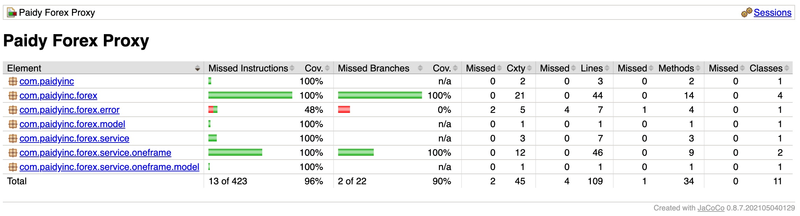

# Paidy Forex Proxy

The application is a local proxy for getting currency exchange rates, so that consumers do not have to care about the
specifics of third-party providers.

- You can find out more about the implementation steps [here](docs/implementation/README.md)

## TL;DR... quick setup/running the app

The quickest way to run the app is with the maven wrapper which is available in the repo, just run this command:

- `sh mvnw clean spring-boot:run` - _MAC/*Nix Shell_
- `mvnw.cmd clean spring-boot:run` - _Windows_

The app will start up using an embedded mock service to get FX Rates, which makes the app more portable as it has no
external dependencies/services.

You can then request FX rates on localhost with the following URI:

- http://localhost:8081/fx/{FROM_CURRECY}/{TO_CURRENCY}
    - e.g. `http://localhost:8081/fx/USD/EUR`

### Got Docker? Use One-frame integration

If you have Docker installed, you can run the Paidy one-frame Docker container (which is mock of a currency exchange
rates service) and get the Forex Proxy to integrate with it to get real-_ish_ FX Rates (_the data is mocked but comes
from an http service external to this app_).

- See more about the container at https://hub.docker.com/r/paidyinc/one-frame

#### Steps to run the Docker container & app

1. `docker run -p 8080:8080 paidyinc/one-frame`
2. `sh mvnw spring-boot:run -Dspring-boot.run.profiles=oneframe`
    - Run the Forex Proxy app with the `oneframe` Spring profile

You can then request FX rates on localhost with the following URI, but this time the data will be coming from One-frame:

- http://localhost:8081/fx/{FROM_CURRECY}/{TO_CURRENCY}
    - e.g. `http://localhost:8081/fx/USD/EUR`

## Like tests? We do!

We like to test our code, and __refactor fearlessly__. The JaCoCo maven plugin helps us to understand how much code
coverage we have.

1. Run `sh mvnw clean install` to run the tests and generate the JaCoCo HTML report
2. View the site report in your browser from [target/site/jacoco/index.html](target/site/jacoco/index.html)
    - 

## Technology used

1. [Java 11](https://openjdk.java.net/projects/jdk/11/)
2. [Spring Boot v2.6.7](https://docs.spring.io/spring-boot/docs/2.6.7/reference/html/)
3. [Spring v5.3.19](https://docs.spring.io/spring-framework/docs/5.3.9/reference/html/)
    1. Using the new reactive [WebClient](https://www.baeldung.com/spring-webclient-json-list) to call third party
       providers
    2. Testing the service that uses a `WebClient` with
       a [MockWebServer](https://www.baeldung.com/spring-mocking-webclient)
4. [Lombok](https://projectlombok.org/)
5. [JaCoCo](https://www.jacoco.org/jacoco/index.html)
    1. [Great primer blog post about JaCoCo](https://www.baeldung.com/jacoco)

----

# Requirements

An internal user of the application should be able to ask for an exchange rate:

1. between 2 given currencies
2. and get back a rate that is not older than 5 minutes.
3. The application should at least support 10,000 requests per day.

## Supported Currencies

The currencies currently supported by the app are a subset of
the [ISO 4217 Currency Codes](https://www.xe.com/iso4217.php) list:

- `AUD, CAD, CHF, EUR, GBP, NZD, JPY, SGD, USD`

## Assumptions/Limitations

1. The list of supported currencies (`AUD, CAD, CHF, EUR, GBP, NZD, JPY, SGD, USD`) are not necessarily supported by the
   One-frame API, but this was a compromise for the MVP
    - The list of currencies supported by one-frame (or any other third-party provider) can get out of sync, but such
      errors from the one-frame API will be handled.
2. As this is an MVP, the `ForexController` has several dependencies injected via it constructor, and it also has some
   logic conditions. I would normally only have one dependency injected in to a Controller, and avoid adding conditional
   logic to keep it simple, ideally only calling a single method on a `@Service` with the business logic.

----

# Future Enhancements

The current version of the app is an MVP, and the following proposed enhancements will be added to the product backlog
and will be added to a future sprint when prioritised accordingly:

1. Externalise the one-frame URI & token to properties
    - so that environment variables can be used and the app redeployed; no further code changes are then needed to
      support a one-frame service deployed somewhere other than `localhost:8080`.
2. Externalise valid FX pairs to properties
    - so that environment variables can be used and the app redeployed; no further code changes are then needed to
      support new currency pairs.
3. Add a unique `requestid` property to each incoming request and send it back in the API response json
    - so that tracing can be achieved between services, and support teams can rapidly diagnose problems by inspecting
      logs.
4. Add a _cache-busting_ querystring param to bypass the `fxCache` Service and always request FX Rate data from the
   backend service:
    - `http://localhost:8081/fx/USD/EUR?no-cache=true`
5. Add support for more third-party FX Rate providers by adding a new implementation of the `FxRateService` interface
    - use a new Spring profile to use the new implementation of the service.
    - makes use of the [`Strategy` Design Pattern](https://en.wikipedia.org/wiki/Strategy_pattern), as no other code
      will need to change, the `FxRateService` contract simply needs to be adhered to.
6. Build the app in a Docker image and run it along with the `paidyinc/one-frame` container
   using [Docker Compose](https://docs.docker.com/compose/)
    - using environment variables is easier when using Docker containers
7. Add a Kubernetes yaml file to run the app and `paidyinc/one-frame` containers in a scalable, fault-tolerant
   Deployment to ensure desired state is maintained.
